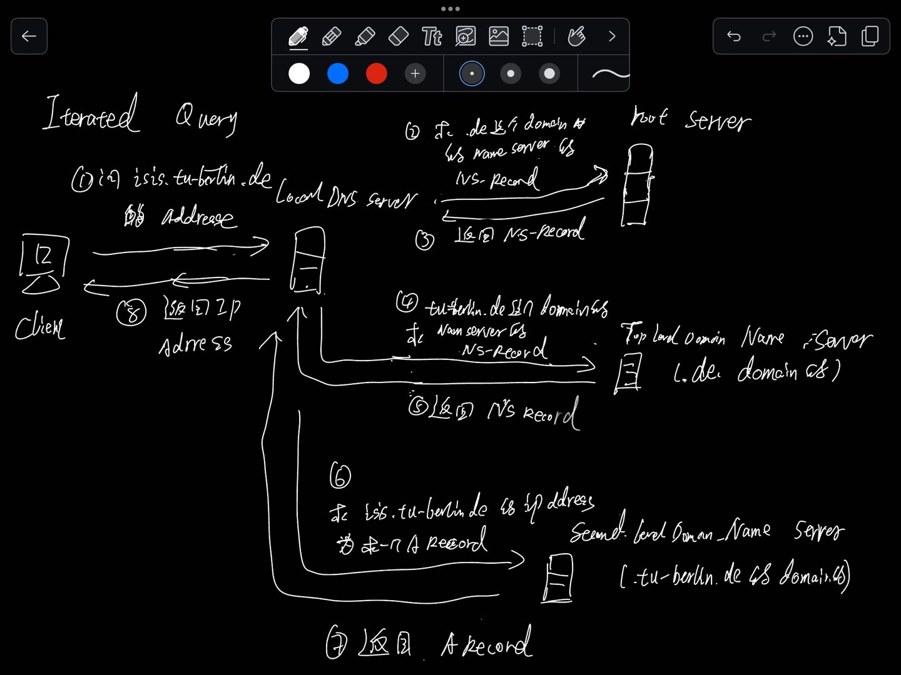

# 1 基础

# 2 一个完整的访问流程

在一个例子   client 访问 isis.tu-berlin.de  的 query process through serveral dns server 

# 3 DNS name resolution

Wie funktioniert das rekursive bzw. iterative Auflösen von Namen mit DNS?
Eine iterative Anfrage beantwortet ein Nameserver mit der Antwort, sofern er diese kennt (ANSWER SECTION), oder einem Verweis auf einen Nameserver, der für diesen Bereich des Namensraums verantwortlich ist (AUTHORITY SECTION & ADDITIONAL SECTION). Durch den hierarchischen Aufbau des DNS ist dies im Zweifel ein root-Nameserver, oder aber eine näherer Server, im Sinne der Hierarchie. 
Bei einer rekursiven Anfrage hingegen übernimmt der angefragte Nameserver die Verantwortung, die Anfrage zu erfüllen. Kennt er die Antwort also nicht, stellt er eine entsprechende Anfrage an den nächsten ihm bekannten Nameserver. Dies ist genau derjenige, an den der Client bei einer iterativen Anfrage verwiesen worden wäre.

## 3.1 Iterative query

## 3.2 recursive query 

DNS recursive resolver  (**recursive query**)

A **DNS recursive resolver** is a server in the Domain Name System (DNS) responsible for resolving domain names into IP addresses on behalf of the client, handling the entire lookup process across multiple DNS servers. This process is known as a **recursive query** because the resolver will recursively query other DNS servers until it finds the IP address associated with a domain or concludes the domain doesn’t exist.

How DNS Recursive Resolvers Work
1. **Client Request**: A client (like a web browser) requests the IP address for a domain, such as `www.example.com`.
2. **Resolver Query**:
    - If the resolver doesn't already have this IP address cached, it begins querying other DNS servers:
3. **Root DNS Server**:
    - The resolver first contacts a **root DNS server**, which responds with a referral to the **Top-Level Domain (TLD)** DNS server (e.g., `.com` TLD for `example.com`).
4. **TLD DNS Server**:
    - The resolver then queries the TLD DNS server. The TLD server responds with a referral to the **authoritative name server** for `example.com`.
5. **Authoritative Name Server**:
    - Finally, the resolver queries the authoritative name server for `example.com`, which provides the IP address.
6. **Response to Client**:
    - The resolver caches this result and returns the IP address to the client, allowing it to connect to the website.

# 4 DNS protocol messages

# 5 常用的protocol 

# 6 DNS  Caching 

## 6.1 TTL im DNS

time to live 

Im Domain Name System (DNS) gibt die TTL an, ==wie lange ein DNS-Eintrag (z. B. die Zuordnung einer Domain zu einer IP-Adresse) im Cache eines DNS-Resolvers gespeichert bleibt==, bevor er erneut abgefragt werden muss.

- **Funktion**: Die TTL legt fest, wie lange eine gespeicherte Antwort als gültig angesehen wird. Nach Ablauf dieser Zeit muss der Resolver eine frische Antwort vom autoritativen DNS-Server holen.
- **Vorteil**: Die TTL hilft, die Netzwerklast zu reduzieren, indem sie unnötige Anfragen vermeidet und die Antwortzeiten verkürzt, da DNS-Informationen eine gewisse Zeit zwischengespeichert werden können. Gleichzeitig ermöglicht eine niedrige TTL schnellere Aktualisierungen, wenn sich ein Eintrag ändert.

**Cache-Verwaltung im DNS (Domain Name System)**: In DNS-Einträgen gibt der TTL-Wert an, wie lange ein Eintrag im Cache eines DNS-Servers gespeichert bleiben darf, bevor er als veraltet angesehen wird. Ein höherer TTL-Wert sorgt für eine längere Zwischenspeicherung und geringere DNS-Anfragen, was die Ladezeiten verbessert. Ein niedrigerer Wert führt dazu, dass Änderungen an DNS-Einträgen schneller übernommen 
werden, da die Einträge häufiger aktualisiert werden.

# 7 一些基础知识问答

Die Zuordnung von Domainnamen zu IP-Adressen erfolgt im Internet mit Hilfe des Domain
Name Systems (DNS). Beschreiben Sie anhand der folgende Fragen den Aufbau
und die Funktionsweise von DNS:

---

Was ist der Unterschied zwischen einem Namen und einer Adresse?

Namen identifizieren eine Entität, Adresse beschreiben, wo sie zu finden sind. Im Schichtenmodell kann ein Wert auch beide Rollen einnehmen. Im Sinne der Anwendungsschicht ist 93.184.216.34 die Adresse zum Namen example.com, in der Netzzugangsschicht allerdings ist es ein Name der beispielsweise eine MAC-Adresse zugeordnet wird.

----

Wie sind die Verantwortlichkeiten im Namenssystem aufgeteilt?

Letzten Endes sind die root-Nameserver im DNS verantwortlich. Diese delegieren die Verantwortung für Teile des Namensraums an andere Server, deren Adresse sie stehts/immer kennen. Dadurch ist ein root-Nameserver stehts in der Lage eine beliebige Anfrage, zumindest indirekt, also durch Rückfragen bei dei den entsprechend verantwortlichen Nameservern, zu erfüllen.

---

Wie funktioniert das rekursive bzw. iterative Auflösen von Namen mit DNS?
Eine iterative Anfrage beantwortet ein Nameserver mit der Antwort, sofern er diese kennt (ANSWER SECTION), oder einem Verweis auf einen Nameserver, der für diesen Bereich des Namensraums verantwortlich ist (AUTHORITY SECTION & ADDITIONAL SECTION). Durch den hierarchischen Aufbau des DNS ist dies im Zweifel ein root-Nameserver, oder aber eine näherer Server, im Sinne der Hierarchie. Bei einer rekursiven Anfrage hingegen übernimmt der angefragte Nameserver die Verantwortung, die Anfrage zu erfüllen. Kennt er die Antwort also nicht, stellt er eine entsprechende Anfrage an den nächsten ihm bekannten Nameserver. Dies ist genau derjenige, an den der Client bei einer iterativen Anfrage verwiesen worden wäre.

---

Welche Funktion erfüllen die TTL-Einträge?
Die TTL-Einträge schränken die Gültigkeit von Einträgen ein. Je höher diese sind, desto weniger Last erfahren die Nameserver, da Anfragen seltener wiederholt werden müssen. Kürzere Einträge erlauben die kurzfristige Änderung von Werten, ohne den Dienst zu beeinträchtigen.

---

Welche Bedeutung haben die verschiedenen Anfragetypen A bzw. NS?
Im DNS-System steht der A-Record (Address Record) für die Zuordnung eines Hostnamens zu einer IP-Adresse. Der NS-Record (Name Server Record) hingegen gibt an, welcher (DNS)-Nameserver für eine Domain zuständig ist.
