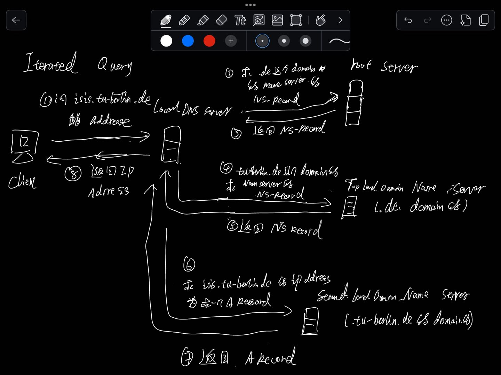

# 1 Domains und Domain Names

**Domain Name System**
- Global verteilte, hierarchische Datenbank zur _**Namensauflösung**_, d.h. zur Abbildung von Domain-Namen auf IP-Adressen
- _**Name Server**_: Datenbank, die eine Anfrage zur Namensauflösung entgegen nimmt und bearbeitet
- _**Resolver**_: Client-Programm, welches die Anfrage zur Namensauflösung stellt
- Verwaltung einer Domain, d.h. des Namensraumes innerhalb dieser Domain, durch den Innhaber der Domain

**Domain Names**
- Jeder _**Domain Name**_ ist Bestandteil des _**Domain Name Space**_
- Jedem Knoten des Domain Name Space ist ein relativer Name zugeordnet (maximal 63 Zeichen, ohne ".")
- Wurzelknoten hat keinen Namen (_**Nullknoten**_, ".")
- _**Absoluter Name**_: eindeutiger Name eines Knotens der sich durch Aneinanderreihung der relativen Namen beim Durchlaufen der Hierarchie in Richtung Wurzelknoten ergibt

- Jede Domain wird durch einen Unterbaum des hierarchischen Namespace repräsentiert
- Domains enthalten andere Domains und Hosts
- Eine Domain enthält alle Hosts deren Domain-Namen innerhalb der Domain liegen
- Domain-Namen, die Hosts repräsentieren, verweisen auf Informationen (_**Resource Records**_) über diese Hosts
- Zuordnung von Hosts zu Domain ist logisch, d.h. nicht geographisch oder nicht bezogen auf die Netztopologie
- Domain-Namen an den Blättern der Hierarchie repräsentieren i.d.R. Hosts und verweisen auf IP-Adressen, Hardware- und Mail-Routing-Informationen
- Domain-Namen an inneren Knoten der Hierarchie repräsentieren Hosts oder die Domain selber (oder beides)

## 1.1 TLD Top-Level Domain

| TLD         | Bedeutung     | Beschreibung                                                                                            |
| ----------- | ------------- | ------------------------------------------------------------------------------------------------------- |
| **`.arpa`** | arpanet       | TLD des ursprünglichen ARPANET, jetzt verwendet als _**Address and Routing Parameter Area**._           |
| `**.biz**`  | business      | Nur für kommerzielle Zwecke; de facto für jeden frei zugänglich                                         |
| `**.com**`  | commercial    | Ursprünglich nur für Unternehmen, seit längerem für jeden frei zugänglich                               |
| `**.info**` | information   | Für Informationsanbieter gedacht, aber für jeden frei zugänglich                                        |
| `**.name**` | name          | Nur für natürliche Personen oder Familien; de facto für jeden frei zugänglich                           |
| `**.net**`  | network       | Ursprünglich für Netzverwaltungseinrichtungen, heute frei für jeden                                     |
| `**.org**`  | organization  | Für nicht-kommerzielle Organisationen (Non-Profit Organizations), heute frei für jeden                  |
| **`.pro`**  | professionals | Für qualifizierte Fachkräfte und Berufsgruppen, die sich entsprechende Zertifikate als solche ausweisen |

- Höchste Stufe der Namensauflösung
- Verwaltet durch die _**Internet Assigned Numbers Authority**_ (_**IANA**_), eine Abteilung der _**Internet Corporation for Assigned Names and Numbers**_ (_**ICANN**_)
- Kontrolle der Unsponsored TLDs durch die ICANN und die Internet Society
- Kontrolle der Sponsored TLDs durch unabhängige Organisationen
- Kontrolle der länderspezifischen TLDs durch Organisationen in den jeweiligen Ländern, in Deutschland durch _**DENIC**_ (_**DEutsches Network Information Center**_)

# 2 Delegation 

- Prinzip des DNS ist die dezentrale Administration des Namensraumes
- Anstelle der zentralen Kontrolle des Namensraumes, beispielsweise durch ICANN, kann die Verwaltung auf allen Ebene delegiert werden
- Inhaber einer Domain kann die Verwaltung der Subdomains innerhalb dieser Domain an andere Organisationen (innerhalb oder außerhalb des Unternehmens) delegieren
    - 域名的持有者可以将该域名下子域名的管理权限委托给其他组织（无论是在公司内部还是外部）。
    - Domain delegate a name server to 管理 某个 subDomain .   就是 下放管理权 

# 3 Zonen und Name Server

https://yoncise.com/2013/07/03/DNS-%E5%92%8C-Nameserver-%E7%9A%84%E5%8C%BA%E5%88%AB/

- **DNS**
    DNS 的全称是 Domain Name _System_, 很多人会误以为是 Domain Name _Server_. DNS 是一套系统, 负责将域名与 IP 地址相对应起来.
- **Nameserver**
    负责实现 DNS 这套系统的服务器, 有时候也叫做 DNS server, 这也是为什么许多人会将 name server 同 DNS 搞混起来的原因.
- **Zone**
    假如有一个域名 bob.sales.example.com, 那么 com 是一个顶级域名(TLD), example 是 com 的一个子域名(Sub-domain), sales 是 example 的子域名, bob 则是一个主机名(Hostname). 一个域名至少有一个子域名. 除了主机名, 一个域名的其它部分都可以叫做 Zone. 

- _**Zone**_: Teil des Namensraumes den ein _**Name Server**_ verwaltet
    - Zonen entstehen durch Delegation: die Verwaltung der Subdomains einer Domain wird an Organisationen ausgelagert, die einen eigenen Name Server betreiben
    - Eine Zone enthält alle Domain Names und zugeordnete Informationen der zugeordneten Domain, ausgenommen der Domain-Namen der "wegdelegierten" Subdomains
- _**Domain**_: repräsentiert einen gesamten Unterbaum des Namensraumes, d.h. alle darin enthaltenen Domain-Namen und zugeordneten Informationen
    - Eine Zone verwaltet den zugeordneten Domain-Namen, inklusive aller **nicht** weg delegierten Subdomains
- _**Resolver**_: ==Client-Programme im DNS==
- Senden Anfragen an einen Name Server mit dem Ziel der Namensauflösung
- Rückgabe der IP-Adresse an das anfragende Programm

## 3.1 Name server 类型 

Top-Level Domain (T LD) servers:
- responsible for .com, .org, .net, .edu, .aero, .jobs, . museums, and all top-level country domains, e.g.: .cn, .uk, .fr, .ca, .jp
- Network Solutions: authoritative registry for .com, .net TLD
- Educause: .edu TLD

Authoritative DNS servers:
- organization's own DNS server(s), providing authoritative hostname to IP mappings for organization's named hosts
- can be maintained by organization or service provider

Local DNS name servers 
- does not strictly belong to hierarchy 
- each ISP (residential ISP, company, university) has one
    - also called "default name server" 
- when host makes DNS query, query is sent to its local DNS server
    - has local cache of recent name-to-address translation pairs (but may be out of date!)
    - acts as proxy, forwards query into hierarchy

Nameserver 主要有四种类型:
1. **Master**
    保存域名的解析信息, 并负责响应其它 Nameserver 查询域名信息的请求.
2. **Slave**
    同 Master 的作用, 作为备用. 区别在于它的解析信息是从 Master 中获取的.
3. **Caching-only**
    不保存有真正的域名的解析信息, 负责响应用户的域名解析的请求, 如果用户请求的数据不存在, 则会向其它 Nameserver 发出查询请求. 查询成功后, 则会将这条记录保存一段时间(TTL), 以供之后的查询用. Google 的 nameserver(8.8.8.8) 就是这种类型.
4. **Forwarding**
    将解析请求转发给一串指定的 nameservers, 如果这其中没有一个能解析成功, 那么这次请求就算失败.

_ps. 一台 nameserver 可能是这个域名的 Master, 同时, 也可能是另一个域名的 Slave._

## 3.2 如何搭建一个 nameserver

搭建一个 nameserver, 可以安装 BIND(Berkeley Internet Name Daemon) 这个软件. 
安装之后可以将服务器配置成上述几种类型的 nameserver, 并可以向服务器中添加相关的解析数据. 具体的关于 BIND 的安装与配置请参考其它资料.

两个例子

1
当你在域名注册商那里注册了一个域名 example.com, 你在域名注册商那里修改 nameserver, 比如修改成 ns1.example.com, ns2.example.com, 其实就相当于在负责 com 解析的那台 nameserver 上修改你的 example.com 的解析信息. (这样就是 name server 的 的机器的 hostname 就是  ns1.example.com 和  ns2.example.com)

你在 ns1.example.com, ns2.example.com 里添加的比如 A 记录, CNAME 记录, 就是具体关于 example.com 这个域名的解析信息.

2 
1. 假如你电脑里配置的 Caching-only nameserver 是 8.8.8.8, 当你请求访问比如 yoncise.com 这个域名, 你的电脑就会向 8.8.8.8 发出域名解析请求, 
2. 假如 8.8.8.8 （Caching-only nameserver ） 发现自己的数据库里没有相关的解析信息, 就会向 root nameserver 发出请求, 
3. root nameserver 发现它也没有 yoncise.com 的解析信息, 但是它知道负责解析 com 域名的 nameserver 的地址, 于是将这个地址返回, 
4. 这时候 Caching-only nameserver(8.8.8.8) 向返回的 nameserver 即 com 的 nameserver 发出 yoncise.com 解析请求, 可惜的是, com 的 nameserver 这里也没有 yoncise.com 的解析信息, 但是它知道谁那里具体保存有 yoncise.com 的解析信息, 于是将这个 nameserver (在域名注册商那里设置的地址) 返回, 
5. 同样的, 8.8.8.8 继续向这个 nameserver 发送请求, 最终获得了 yoncise.com 的域名解析信息并将数据返回给你.

访问 yoncise.com 这个域名： 
6. Caching-only nameserver 是 8.8.8.8: 
    1. Caching-only nameserve 没有 yoncise.com 这个域名 解析信息 
7. Caching-only nameserver 向  root nameserver 发出请求: 
    2. root nameserver  发现它也没有 yoncise.com 的解析信息
    3. root nameserver 向 Caching-only nameserver  返回 解析 com 域名的 nameserver 的地址
8. Caching-only nameserver(8.8.8.8) 向 com 的 nameserver 发出 yoncise.com 解析请求: 
    4. com 的 nameserver 这里也没有 yoncise.com 的解析信息, 
    5. 但是  com 的 nameserver  知道谁那里具体保存有 yoncise.com 的解析信息, 于是将这个 nameserver (在域名注册商那里设置的地址) 返回, 
9. Caching-only nameserver(8.8.8.8) 继续向这个 nameserver 发送请求
    6. 最终获得了 yoncise.com 的域名解析信息并将数据返回给你.

# 4 DNS name resolution

## 4.1 完整的访问流程

- Name Server liefern nicht nur Daten über ihre Domain, sondern können den gesamten Domain Name Space durchsuchen (_**Resolution**_, _**Namensauflösung**_)
- Jeder Name Server kennt ein oder mehrere _**Root Name Server**_
- Name Server kontaktieren einen Root Name Server zur Namensauflösung beliebiger Domains im Domain Name Space
- Root Name Server speichern Verweise auf die zuständigen Name Server der TLDs
- Anfragen zur Auflösung werden an einen Root Name Server geleitet und mit der Adresse des zuständigen Name Servers der TLD beantwortet
- Nächste Anfrage wird an den Name Server der TLD gesendet, um die Adresse des Name Servers der Second Level Domain zu erhalten, usw.

在一个例子   client 访问 isis.tu-berlin.de  的 query process through serveral dns server 

## 4.2 rekursive bzw. iterative Query

Wie funktioniert das rekursive bzw. iterative Auflösen von Namen mit DNS?
- Eine iterative Anfrage beantwortet ein Nameserver mit der Antwort, sofern er diese kennt (ANSWER SECTION), oder einem Verweis auf einen Nameserver, der für diesen Bereich des Namensraums verantwortlich ist (AUTHORITY SECTION & ADDITIONAL SECTION). Durch den hierarchischen Aufbau des DNS ist dies im Zweifel ein root-Nameserver, oder aber eine näherer Server, im Sinne der Hierarchie. 
- Bei einer rekursiven Anfrage hingegen übernimmt der angefragte Nameserver die Verantwortung, die Anfrage zu erfüllen. Kennt er die Antwort also nicht, stellt er eine entsprechende Anfrage an den nächsten ihm bekannten Nameserver. Dies ist genau derjenige, an den der Client bei einer iterativen Anfrage verwiesen worden wäre.

### 4.2.1 Iterative query

Iterated query:
• contacted server replies with name of server to contact
• "l don't know this name, but ask this server"

### 4.2.2 recursive query 

DNS recursive resolver  (**recursive query**)

Recursive query:
• puts burden of name resolution on contacted name server
• heavy load at upper levels of hierarchy?

A **DNS recursive resolver** is a server in the Domain Name System (DNS) responsible for resolving domain names into IP addresses on behalf of the client, handling the entire lookup process across multiple DNS servers. This process is known as a **recursive query** because the resolver will recursively query other DNS servers until it finds the IP address associated with a domain or concludes the domain doesn’t exist.

How DNS Recursive Resolvers Work
10. **Client Request**: A client (like a web browser) requests the IP address for a domain, such as `www.example.com`.
11. **Resolver Query**:
    - If the resolver doesn't already have this IP address cached, it begins querying other DNS servers:
12. **Root DNS Server**:
    - The resolver first contacts a **root DNS server**, which responds with a referral to the **Top-Level Domain (TLD)** DNS server (e.g., `.com` TLD for `example.com`).
13. **TLD DNS Server**:
    - The resolver then queries the TLD DNS server. The TLD server responds with a referral to the **authoritative name server** for `example.com`.
14. **Authoritative Name Server**:
    - Finally, the resolver queries the authoritative name server for `example.com`, which provides the IP address.
15. **Response to Client**:
    - The resolver caches this result and returns the IP address to the client, allowing it to connect to the website.

# 5 DNS  Caching 

- Während der Namensauflösung erhalten Name Server viele Informationen über die zuständigen Name Server anderer Domains und ihre Adressen bzw. über die Adressen der Hosts einer Domain
- _**Caching**_: Speichern der für bestimmte Domains zuständigen Name Server und der darin verwalteten Hosts für zukünftige Zwecke
- Bei nachfolgenden Anfragen prüft Name Server zunächst den lokalen Cache
- Verkürzung der Anfragekette wenn lokaler Cache einen Name Server nahe der Ziel-Domain oder sogar den gesuchten Host enthält
- _**Time To Live**_: Haltbarkeitszeit für Cache-Einträge (werden nach Ablauf gelöscht)
- Time To Live wird vom Verwalter der zuständigen Zone vergeben, in dessen Bereich die Domain liegt

- Performing all these queries takes time 
    - And all this before actual communication takes place
    - E.g., I-second latency before starting Web download
- Caching can greatly reduce overhead
    - The top-level servers very rarely change
    - Popular sites (e.g., www.cnn.com) visited often
    - Local DNS server often has the information cached
- How DNS caching works
    - DNS servers cache responses to queries
    - Responses include a "time to live" (TTL) field
    - Server deletes cached entry after TTL expires

## 5.1 TTL im DNS

time to live 

Im Domain Name System (DNS) gibt die TTL an, ==wie lange ein DNS-Eintrag (z. B. die Zuordnung einer Domain zu einer IP-Adresse) im Cache eines DNS-Resolvers gespeichert bleibt==, bevor er erneut abgefragt werden muss.

- **Funktion**: Die TTL legt fest, wie lange eine gespeicherte Antwort als gültig angesehen wird. Nach Ablauf dieser Zeit muss der Resolver eine frische Antwort vom autoritativen DNS-Server holen.
- **Vorteil**: Die TTL hilft, die Netzwerklast zu reduzieren, indem sie unnötige Anfragen vermeidet und die Antwortzeiten verkürzt, da DNS-Informationen eine gewisse Zeit zwischengespeichert werden können. Gleichzeitig ermöglicht eine niedrige TTL schnellere Aktualisierungen, wenn sich ein Eintrag ändert.

**Cache-Verwaltung im DNS (Domain Name System)**: In DNS-Einträgen gibt der TTL-Wert an, wie lange ein Eintrag im Cache eines DNS-Servers gespeichert bleiben darf, bevor er als veraltet angesehen wird. Ein höherer TTL-Wert sorgt für eine längere Zwischenspeicherung und geringere DNS-Anfragen, was die Ladezeiten verbessert. Ein niedrigerer Wert führt dazu, dass Änderungen an DNS-Einträgen schneller übernommen 
werden, da die Einträge häufiger aktualisiert werden.

# 6 DNS protocol messages

# 7 常用的protocol 

# 8 一些基础知识问答

Die Zuordnung von Domainnamen zu IP-Adressen erfolgt im Internet mit Hilfe des Domain
Name Systems (DNS). Beschreiben Sie anhand der folgende Fragen den Aufbau
und die Funktionsweise von DNS:

---

Was ist der Unterschied zwischen einem Namen und einer Adresse?

Namen identifizieren eine Entität, Adresse beschreiben, wo sie zu finden sind. Im Schichtenmodell kann ein Wert auch beide Rollen einnehmen. Im Sinne der Anwendungsschicht ist 93.184.216.34 die Adresse zum Namen example.com, in der Netzzugangsschicht allerdings ist es ein Name der beispielsweise eine MAC-Adresse zugeordnet wird.

----

Wie sind die Verantwortlichkeiten im Namenssystem aufgeteilt?

Letzten Endes sind die root-Nameserver im DNS verantwortlich. Diese delegieren die Verantwortung für Teile des Namensraums an andere Server, deren Adresse sie stehts/immer kennen. Dadurch ist ein root-Nameserver stehts in der Lage eine beliebige Anfrage, zumindest indirekt, also durch Rückfragen bei dei den entsprechend verantwortlichen Nameservern, zu erfüllen.

---

Wie funktioniert das rekursive bzw. iterative Auflösen von Namen mit DNS?
Eine iterative Anfrage beantwortet ein Nameserver mit der Antwort, sofern er diese kennt (ANSWER SECTION), oder einem Verweis auf einen Nameserver, der für diesen Bereich des Namensraums verantwortlich ist (AUTHORITY SECTION & ADDITIONAL SECTION). Durch den hierarchischen Aufbau des DNS ist dies im Zweifel ein root-Nameserver, oder aber eine näherer Server, im Sinne der Hierarchie. Bei einer rekursiven Anfrage hingegen übernimmt der angefragte Nameserver die Verantwortung, die Anfrage zu erfüllen. Kennt er die Antwort also nicht, stellt er eine entsprechende Anfrage an den nächsten ihm bekannten Nameserver. Dies ist genau derjenige, an den der Client bei einer iterativen Anfrage verwiesen worden wäre.

---

Welche Funktion erfüllen die TTL-Einträge?
Die TTL-Einträge schränken die Gültigkeit von Einträgen ein. Je höher diese sind, desto weniger Last erfahren die Nameserver, da Anfragen seltener wiederholt werden müssen. Kürzere Einträge erlauben die kurzfristige Änderung von Werten, ohne den Dienst zu beeinträchtigen.

---

Welche Bedeutung haben die verschiedenen Anfragetypen A bzw. NS?
Im DNS-System steht der A-Record (Address Record) für die Zuordnung eines Hostnamens zu einer IP-Adresse. Der NS-Record (Name Server Record) hingegen gibt an, welcher (DNS)-Nameserver für eine Domain zuständig ist.
