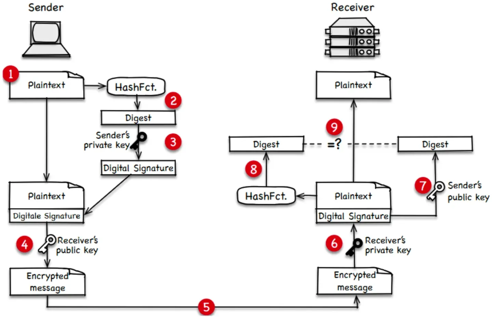

# 1 Verschlüsselung

Symmetrische Verschlüsselung

- Ein _**symmetrischer Schlüssel**_ wird zum Ver- und Entschlüsseln von Nachrichten verwendet
- Zweck: Vertraulichkeit
- Beiden Kommunikationspartnern muss der symmetrische Schlüssel bekannt sein
- Dritte dürfen keinen Zugang zum symmetrischen Schlüssel erlangen
- Vorteil: Geschwindigkeit und Effizient
- Nachteil: Schlüsselverteilung, d.h. wie erlangt der Kommunikationspartner den symmetrischen Schlüssel, ohne dass dieser von einem Angreifer abgehört wird?
- Verfahren
    - ​_**Data Encryption Standard**_ (_**DES**_) mit 56-Bit-Schlüssel
    - _**Advanced Encryption Standard**_ (_**AES**_) mit 128-, 192- oder 256-Bit-Schlüsseln

Asymmetrische Verschlüsselung

- _**Asymmetrische Verschlüsselung**_ (_**Public-Key-Verschlüsselung**_) basiert auf Schlüsselpaaren mit jeweils einem _**öffentlichen**_ und einem **privaten Schlüssel**
- Jeder Teilnehmer verfügt über ein Schlüsselpaar und teilt seinem Kommunikationspartner seinen öffentlichen Schlüssel mit
- Privater Schlüssel ist ein Geheimnis und darf mit niemandem geteilt werden
- Vertraulichkeit wird erreicht, in dem die Nachricht mit dem öffentlichen Schlüssel des Empfängers verschlüsselt wird
- Nachteil: asymmetrische Verschlüsselung ist sehr berechnungsintensiv
- Verfahren
    - ​_**RSA**_ (_**Rives-Shamir-Adleman**_)
    - **_Diffie-Hellman_** (für Schlüsselaustausch)
    - _**Elliptic Curve Cryptography**_ (_**ECC**_)

# 2 Digitale signaturen

- Eine **_Digitale Signatur_** dient der Authentifizierung des Senders einer Übertragung und stellt zugleich die Integrität der Übertragung sicher
- Von der zu sendenden Nachricht wird mit Hilfe einer Hash-Funktion ein **_Digest_** (_**Extrakt**_) einer begrenzten Länge berechnet
- Der Digest wird mit dem privaten Schlüssel des Senders verschlüsselt und bildet somit die Digitale Signatur
- Die Signatur wird an die zu übertragende Nachricht angehängt
- Der Empfänger entschlüsselt die Signatur mit dem öffentlichen Schlüssel des Senders und erhält den ursprünglichen Digest
- Der Empfänger berechnet anhand derselben Hash-Funktion einen Digest von der übertragenden Nachricht
- Sind berechneter und empfangener Digest identisch, ist der Sender authentifiziert und die Integrität der Nachricht ist sichergestellt

---

1. Sender erstellt Nachricht mit Inhalt.
2. Mathematische Berechnung, genannt Hashfunktion wird auf Nachricht angewendet, um einen Digest zu generieren.
3. Sender benutz seinen privaten Schlüssel, um den Digest zu verschlüsseln, woraus sich die digitale Signatur ergibt - niemand kann die digitale Signatur des Senders replizieren.
4. Sender verschlüsselt sowohl die originale Nachricht als auch die digitale Signatur mit dem öffentlichen Schlüssel des Empfängers.
5. Das verschlüsselte Bündel aus Nachricht und digitaler Signatur wird an den Empfänger übertragen.
6. Der Empfänger nutzt seinen privaten Schlüssel, um das empfangene Bündel zu entschlüsseln.
7. Der Empfänger nutzt den öffentlichen Schlüssel des Senders, um die digitale Signatur zu entschlüsseln und den Digest der Originalnachricht zu extrahieren.
8. Mithilfe der selben Hashfunktion erstellt der Empfänger einen Digest der empfangenen und entschlüsselten Nachricht.
9. Der Empfänger vergleicht diesen Digest mit dem der Originalnachricht, um die Authentität der empfangenen Nachricht zu verifizieren.

# 3 Digitales Zertifikat

- Ein **_Digitales Zertifikat_** ist eine durch eine Zertifizierungsstelle ausgestellte Urkunde, die im Wesentlichen den öffentlichen Schlüssel des Zertifikatsinhabers enthält
- **_Zertifikatsinhaber_** ist durch Name und Adresse, insbesondere aber auch durch ein oder mehrere Domain-Namen hinterlegt
- **_Zertifizierungsstelle_** ist eine vertrauenswürdige Partei, welche das Digitale Zertifikat herausgibt und mit ihrem privaten Schlüssel digital signiert
- Der Zertifikatsinhaber übersendet seinen Kommunikationspartnern sein Zertifikat und teilt ihnen damit seinen öffentlichen Schlüssel mit
- Die Empfänger eines Zertifikats überprüfen die digitale Signatur des Zertifikats - sie benötigen dafür den öffentlichen Schlüssel der Zertifizierungsstelle
- Zertifikate garantieren, dass ein öffentlicher Schlüssel tatsächlich zu der Person gehört, die sie vorgibt zu sein, und verhindern die Verfälschung von Identitätsangaben oder des öffentlichen Schlüssels

# 4 Schlüsselvereinbarung mit Diffie-Hellman

- _**Diffie-Hellman**_ (_**DH**_) ist ein Verfahren zur Vereinbarung eines symmetrischen Sitzungsschlüssels über einen abhörbaren, unsicheren Kommunikationskanal
- Verschiedene Varianten, u.a. _**Ephemeral DH**_ (_**EDH**_ oder _**DHE**_) und _**Elliptic Curve DH**_ _**Ephemeral**_ (**ECDHE**)

---

Klassisches Diffie-Hellman
- Partner tauschen ein gemeinsamen Schlüssel über ungesicherte Verbindung aus
- Durch Kombination von gemeinsamem und jeweiligem privaten Schlüssel berechnen beide Seiten einen öffentlichen Schlüssel und tauschen diesen aus
- Verschlüsselung des öffentlichen Schlüssel der Gegenseite mit dem eigenen privaten Schlüssel resultiert auf beiden Seiten in demselben symmetrischen Sitzungsschlüssel

Ephemeral Diffie-Hellman (EDH oder DHE)
- Verwendung des klassischen DH-Verfahrens zur Erzeugung flüchtiger (ephemeral) Sitzungsschlüssel 
- Flüchtige Sitzungsschlüssel werden nach der Verbindung gelöscht und ermöglichen Perfect Forward Secrecy
- _**Perfect Forward Secrecy**_ verhindert den Nachtragszugriff auf verschlüsselte Verbindung bei Kompromittierung eines langfristigen Schlüssels, z.B. wenn verschlüsselte Nachrichtenaustausche aufgezeichnet und später entschlüsselt werden

----

Elliptic Curve Diffie-Hellman Ephemeral (ECDHE) 
- Alternative zur Erzeugung ephemeraler Schlüssel basierend auf elliptischer Kurvenmultiplikation (Elliptic Curve Multiplication, ECC)
- Kommunikationspartner generieren jeder ein asymmetrisches Schlüsselpaar aus öffentlichem und privatem Schlüssel
- Öffentliche Schlüssel werden ausgetauscht
- Kombination von empfangenem öffentlichen Schlüssel mit eigenem privaten Schlüssel führt auf beiden Seiten zu demselben symmetrischen Sitzungsschlüssel

# 5 Was ist eine Cipher Suite?

 Cipher Suites in TLS 1.2 und 1.3
 
## 5.1 Unterstützte Cipher Suites in TLS 1.2
- `**TLS_ECDHE_ECDSA_WITH_AES_128_GCM_SHA256**`
- `**TLS_ECDHE_ECDSA_WITH_AES_256_GCM_SHA384**`
- `**TLS_ECDHE_ECDSA_WITH_AES_128_CBC_SHA256**`
- `**TLS_ECDHE_ECDSA_WITH_AES_256_CBC_SHA384**`
- `**TLS_ECDHE_RSA_WITH_AES_128_GCM_SHA256**`
- `**TLS_ECDHE_RSA_WITH_AES_256_GCM_SHA384**`
- `**TLS_ECDHE_RSA_WITH_AES_128_CBC_SHA256**`
- `**TLS_ECDHE_RSA_WITH_AES_256_CBC_SHA384**`
- `**TLS_ECDHE_RSA_WITH_AES_128_CBC_SHA256**`
- `**TLS_ECDHE_RSA_WITH_AES_256_CBC_SHA384**`
- `**TLS_DHE_RSA_WITH_AES_128_GCM_SHA256**`
- `**TLS_DHE_RSA_WITH_AES_256_GCM_SHA384**`
- `**TLS_DHE_RSA_WITH_AES_128_CBC_SHA**`
- `**TLS_DHE_RSA_WITH_AES_256_CBC_SHA**`
- `**TLS_DHE_RSA_WITH_AES_128_CBC_SHA256**`
-  `**TLS_DHE_RSA_WITH_AES_256_CBC_SHA256**`
- `**TLS_ECDHE_ECDSA_WITH_CHACHA20_POLY1305_SHA256**`
- `**TLS_ECDHE_ECDSA_WITH_CHACHA20_POLY1305**`
- `**TLS_ECDHE_RSA_WITH_CHACHA20_POLY1305_SHA256**`
- `**TLS_ECDHE_RSA_WITH_CHACHA20_POLY1305**`

Unterstützte Cipher Suites in TLS 1.3
- `**TLS_AES_256_GCM_SHA384**`
- `**TLS_CHACHA20_POLY1305_SHA256**`
- `**TLS_AES_128_GCM_SHA256**`
- `**TLS_AES_128_CCM_8_SHA256**`
- `**TLS_AES_128_CCM_SHA256**`

# 6 SSL/TLS

SSL: Secure Sockets Layer 安全套接字 协议
TLS: Transport Layer Security  传输层安全协议 

他们主要用于 在 internet 上数据传输的安全性和完整性 

看[[使用数字证书通讯]] 

## 6.1 加密验证方式 

## 6.2 公钥和私钥

#

公钥和私钥都可以用于 加密解密
公钥加密，私钥解密： 称为信息加密与信息解密
私钥加密， 公钥解密： 称为数字签名与签名验证

# 7 HTTPS重要概念

## 7.1 SSL, TLS & HTTPS

certificate: 
Secure Sockets Layer (SSL) certificates, sometimes called digital certificates, are used to establish an encrypted connection between a browser or user’s computer and a server or website.

SSL: Secure Sockets Layer
[SSL](https://www.digicert.com/faq/public-trust-and-certificates/what-is-ssl) is standard technology for securing an internet connection by encrypting data sent between a website and a browser (or between two servers). It prevents hackers from seeing or stealing any information transferred, including personal or financial data.

TLS: Transport Layer Security
TLS is an updated, more secure version of SSL. We still refer to our security certificates as SSL because it’s a more common term, but when you buy SSL from DigiCert, you get the most trusted, up-to-date TLS certificates.

HTTPS: Hyper Text Protocol Secure
HTTPS appears in the URL when a website is secured by an SSL/TLS certificate. Users can view the details of the certificate, including the issuing authority and the corporate name of the website owner, by clicking the lock symbol on the browser bar.

## 7.2 数字证书 (SSL/TLS 证书)

某个通讯方的 数字证书:
通讯方的数字证书是 可以是 被某个权威CA 颁发的。 
里面包含了 通讯方的信息， 通讯方的公钥， 证书有效时间， 域名， CA的数字签名 

某个私人用户的 数字证书 
可以是也可是自己生成的。 用户自己搭建一个ca, 然后用 ca 生成 自己的数字证书。 将这个ca 的公钥和 用户自己的数字证书 分享给 其他的用户
里面包含了 私人用户的个人信息， 私人用户的公钥， 证书有效时间， 域名

## 7.3 根证书 (CA公钥)

CA 产生的某个用户的 数字证书 是进过 CA私钥 加密的。 
CA 会将 生成的数字证书 和 CA 公钥 发给 user 

## 7.4 数字摘要

利用 hash 函数产生的 值

摘要就是 某个 image 的 RepoDigests 项的内容 

## 7.5 数字签名 

数字签名 ( 就是用 用户x自己私钥 加密明文后 得到的密文) 
一般会将 密文 （数字签名） 附到 明文后， 形成一个整个东西， 回复给 提出联络的 user 

例子 

CA3 生成 tu.berlin 的 电子签名 
tu.berlin 的 电子签名  包含了 tu.berlin 的 publickey, tu.berlin的 信息 和 signature which is issued by CA3 
Signature which is issued by CA3  是 CA3用自己的 private key  生成的.  CA3将这个 digital signture 封印在 tu.berlin 的 电子签名  中 
用 CA3 的public key  可以去解密  tu.berlin 的电子签名  

# 8 基础知识 

## 8.1 明文通信过程 

## 8.2 使用 数字签名加密

## 8.3 钓鱼问题

## 8.4 使用数字证书通讯 (非对称加密 TLS/SSL)

[97_01_HTTP_HTTPS协议](97_01_HTTP_HTTPS协议.md)

整个通信过程包含三个阶段： 通信基础构建阶段， 通信关系建立阶段与通信阶段 

要区分 数字证书 和 数字签名 
1 通信基础构建阶段
特工张三 将自己的个人信息 和个人公钥 发给ca.
ca 用ca的私钥 加密 张三的公钥和个人信息, 然后生成张三的数字证书和 CA公钥 

这个阶段的最终结果就是 用户张三 从 ca 处 得到 数字证书和 CA公钥

CA: Certificate Authority
数字证书中包含： 用户 张三 的个人信息 和 用户 1 的公钥 
数字证书 就是用 CA 的私钥 加密后 形成的。 只有用 CA 的公钥 才能解密。

2 通信关系建立阶段
这个阶段的最终结果就是 用户李四  得到 用户张三 数字证书 (用户1 的个人信息和用户1的公钥  ) 和 CA公钥
将用户 张三  的数字证书和CA公钥 交给用户 李四
用户 李四 用 CA的公钥 解密 用户 张三 的数字证书， 从而得到用户张三  的个人信息和用户1的公钥 

3 通信阶段

因为在 阶段2 已经 李四 获得了 用户张三 数字证书  (个人信息和用户1的公钥) 
所以在 阶段3 的 初始阶段， 例子用 ca公钥 解密 用户x的数字证书, 从而获得 用户x 的个人信息和用户x的公钥。 对比之下就能  李四 发现 用户x 是不是 张三 .

上图中第二个4 是多余的 

在 阶段3 的 握手阶段， 
10. 用户李四 使用 阶段3 的 初始阶段 获得的 用户x 的公钥。 用户李四 用 用户x 的公钥  来加密 用户李四 想给用户x 的指令 
11. 用户x 使用自己的私钥 去解密. 
12. 用户x 把想要 回复给 用户李四 的内容:   回复的内容的明文 + 数字签名 ( 就是用 用户x自己私钥 加密明文后 得到的密文) + 用户x 的数字证书
13. 用户2 得到上面东西后 
    1. 用ca 公钥 解密用户x 的数字证书， 看看用户x 是不是争取的用户
    2. 用用户x的公钥 解密 数字证书， 得到解密后的 明文
    3. 讲解密后的明文 和  直接得到的加密后的明文 比较， 看看消息有没有被篡改

## 8.5 对称加密 (https 的工作原理)

整个通信过程包含三个阶段： 通信基础构建阶段， 通信关系建立阶段与通信阶段 
身份验证采用非对称加密方式, 通信过程采用对称加密方式 

1 通信基础构建阶段
这个和非对称加密通信(使用数字证书通讯 ) 是一样的 没有变化 

2 通信关系建立阶段
这个和非对称加密通信(使用数字证书通讯 ) 多了 5,6,7 过程 
==重点是用户2 生成了 秘钥R , 这个 秘钥会在以后的通信过程中用到 ==
用户 2 自己会保存 密钥R, 然后也会将 R 分享给 用户x

3 通信阶段
这个阶段 这个和非对称加密通信(使用数字证书通讯 ) 比较 , 4,5,6,7,8 就不在使用 CA证书了 ， 而使用 密钥R 

# 9 HTTPS通信过程 

和对称加密过程基本相似 

整个通信过程包含三个阶段： 通信基础构建阶段， 通信关系建立阶段与通信阶段 

1 通信基础构建阶段

2 通信关系建立阶段

3 通信阶段 

