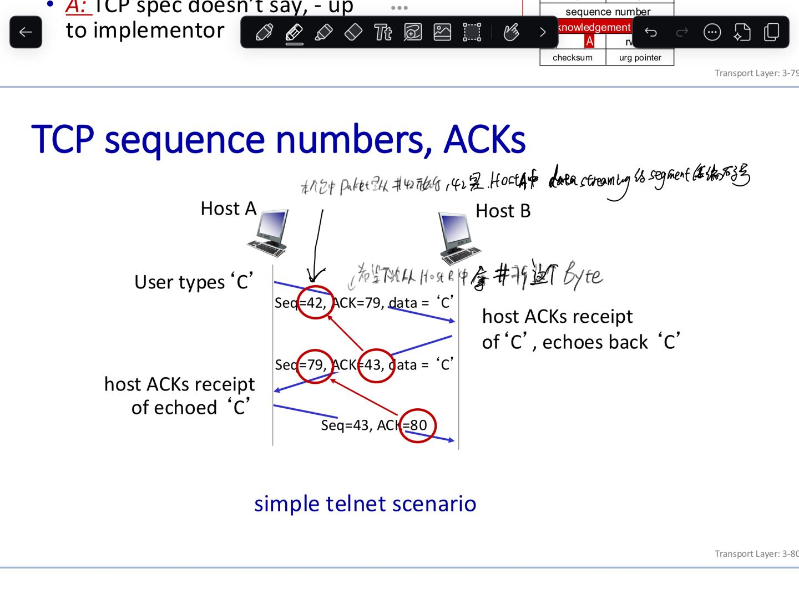
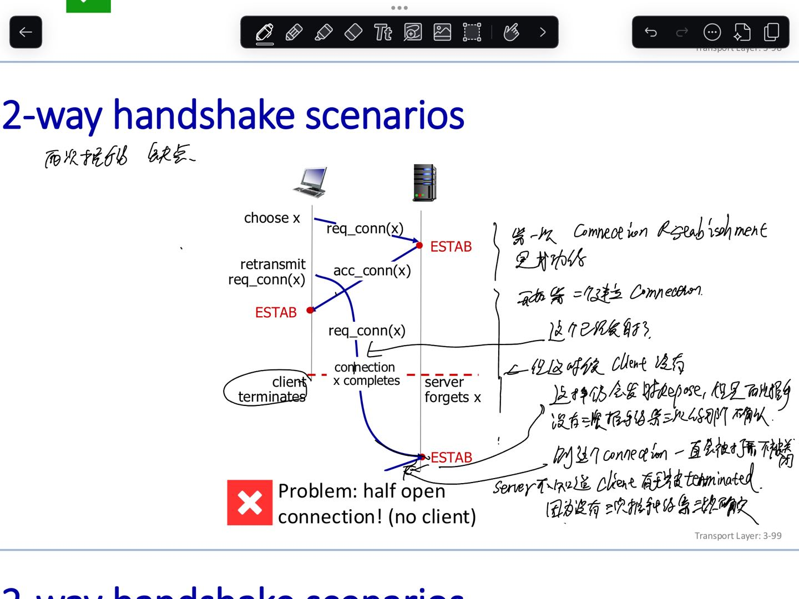
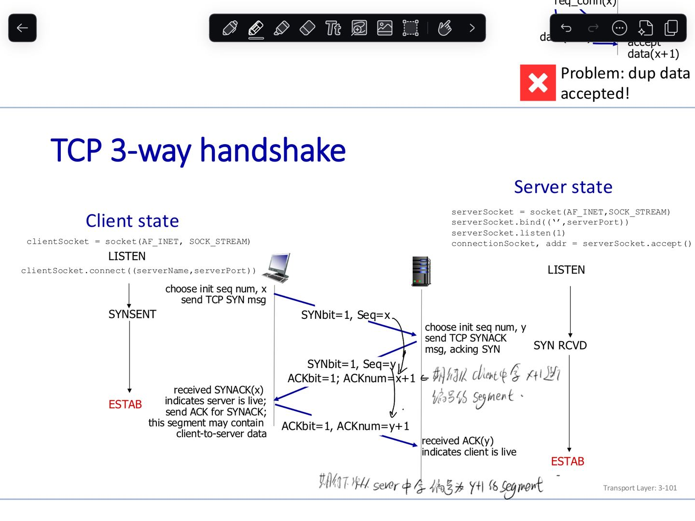
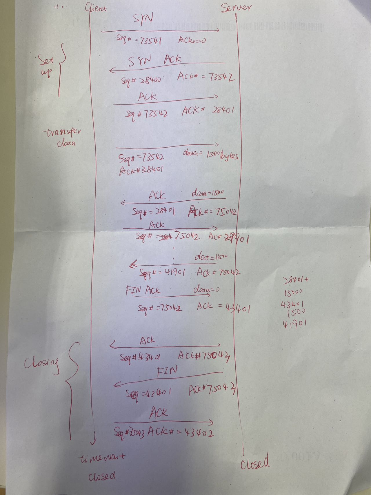

# 1 总览 

TCP header includes addressing (ports), sliding window (seq. / ack. number), flow control (window), error control (checksum) and more.


TCP报文头的组成信息

- 第0-3位 ：Source Port 和 Destination Port
    - Port numbers: like for UDP
- 第4-7位 ：Sequence Number (SEQ): byte stream “number” of first byte in segment’s data 
    - 32 bit sequence number (SN) uniquely identify the application data contained in the TCP segment
    - SN is in bytes! It identify the first byte of data
- 第8-11位： Acknowledgment Number (ACK): seq # of next byte expected from other side
    - 32 bit acknowledgment number (AN) is used for piggybacking ACK’s
    - AN indicates the next byte that the receiver is expecting
    - Implicit ACK for all of the bytes up to that point (cumulative)
- 第12-15位： Offset 、Reserved（保留域默认为0） 、TCP Flags（C E U A P R S F）、Windows
    - Data offset (TCP header length) is the header length in 32 bit words (minimum 20 bytes)
    - Window size
        - Used for error recovery & as a flow control mechanism - sender cannot have more than a window of packets (bytes) in the network simultaneously
        - Window scaling used to increase the window size in high speed networks
        - 里面是数值是 bytes the receiver willing to accept,  就是 receiver 端的 buffer 还有多少空间 
- 第16-19位：Checksum（16位计算，发送端计算存储，接收端校验）、 Urgent Pointer
    - Checksum covers the header and data
- 第20-n位： TCP  Options (例如：variable length, optional)


# 2 TCP  Options 
## 2.1 TCP Window Scaling

windows 的 width 会改变 

Problem when using lines/networks with high bandwidth and/or high delay => 64-KB window corresponding to a 16-bit field is a problem
Example:
- On OC-12 line (~ 600 Mbps) it takes less than 1 msec to output a full 64-KB window
- If round-trip propagation delay is 50 msec (typical for a transcontinental fiber), the sender will be idle more than 98% of the time waiting for acknowledgements!
- A larger window size would allow sender to keep pumping data out

Window scale option allows sender & receiver to negotiate a window scale factor at start of a connection:
- Scale factor is used to shift Window size field up to 14 bits to the left, i.e. windows of up to 230 bytes


## 2.2 TCP Timestamping

- The timestamp option carries a timestamp sent by sender and echoed by receiver
- Is included in every packet
- Used to compute round-trip time samples that are used to estimate when a packet has been lost
- Also used as a logical extension of 32-bit sequence number:
    - Note: on a fast connection, the sequence number may wrap around quickly, leading to possible confusion between old and new data!
    - PAWS (Protection Against Wrapped Sequence numbers) scheme discards arriving segments with old timestamps to prevent this problem


## 2.3 TCP Selective ACKnowledgement

- SACK (Selective ACKnowledgement) option lets a receiver tell a sender the ranges of sequence numbers that it has received
- It supplements the Acknowledgement number and is used after a packet has been lost but subsequent (or duplicate) data has arrived
- The new data is not reflected by the Acknowledgement number field in header because that field gives only the next in-order byte that is expected
- With SACK, the sender is explicitly aware of what data the receiver has and hence can determine what data should be retransmitted


# 3 Port

In TCP und UDP erlauben Ports die Zuordnung der eingehenden Datenpakete zur richtigen Applikation. Dadurch lassen sich mehrere Datenströme auf einem Host multiplexen.


- Lokale Hausnummer innerhalb eines Rechners zur Adressierung einer bestimmten Anwendung
- Gültige Portnummern: 0-65535
- **_Systemports_**: 0-1023, reserviert für bestimmte Dienste, Standardisierung durch die IETF
- **_Registrierte Ports_**: 1024-49151, reserviert für registrierte Dienste, Zuweisung ohne IETF (veraltet)
- **_Dynamische Ports_**: 49152-65536, Vergabe durch das Betriebssystem

- TCP-Verbindung wird durch zwei Endpunkte identifiziert
- Endpunkt wird durch Internetadresse und Port repräsentiert
- **_Socket_**: Softwareschnittstelle des Endpunktes Sockets werden beim Verbindungsaufbau auf beiden Seiten initialisiert
- Jede TCP-Verbindung wird repräsentiert durch IP-Addresse lokal, Port lokal, IP-Adresse entfernt, Port entfernt


# 4 sequence numbers (SEQ) and Acknowledgement number(ACK)





Sequenznummer
- Bezeichnet die Byte-Position des Segments im Datenstrom
- Wird um die Anzahl der gesendeten Bytes erhöht
- Ausnahme: Segmente mit gesetztem **SYN** und **FIN**-Flag (ohne Daten) erhöhen die Sequenznummer um 1
- Beim Verbindungsaufbau wird die Startsequenznummer gewürfelt

 Bestätigungsnummer
- Bestätigen dem ursprünglichen Absender den erfolgreichen Empfang seiner Daten
- Bestätigt wird das zuletzt erfolgreich empfangene Byte
- Aber: Bestätigungsnummer gibt das als nächste erwartete Byte an


# 5 标志位 (tag)
 tcp 的首部有一个标志位。
对应的值  都是0和1分别表示相反的两种状态: 1有效/0忽略, 1有数据传输/0没有数据传输


| x           | x                         | x                                                                                                                     | x   |
| ----------- | ------------------------- | --------------------------------------------------------------------------------------------------------------------- | --- |
| `[C]`: CWR  | Congestion Windos Reduced |                                                                                                                       |     |
| `[E]`: ECE  | ECN-Echo                  |                                                                                                                       |     |
| `[U]`: URG  | Urgend Pointer            | 紧急指针有效. Wenn er gesetzt ist, muss der Urgend Pointer beachtet werden.                                                 |     |
| `[A]:` ACK  | Ackonwledge               | 确认序号有效                                                                                                                |     |
| `[P]` : PSH | push                      | 推送数据, 接收方应尽快将报文段交给应用层 , die Daten sofort nach der ANkunft an die nächsthöhere Eben des ISO/OSI-Models gegeben werden. |     |
| `[R] `: RST | rest                      |                                                                                                                       |     |
| `[S]` : SYN | synchronise               | 开始连接, 同步序号，用来发起一个连接                                                                                                   |     |
| `[F]` : FIN | fin??                     | 结束连接, 发送端完成发送任务. (hier läuft es genau so wie beim Verbindungsaufbau, FIN-->ACK,FIN-->ACK)                             |     |
|             |                           |                                                                                                                       |     |

- Alle TCP-Verbindungen beginnen mit einem _TCP-Handshake_ zum Verbindungsaufbau
- Nutzdaten können erst nach erfolgreichem Verbindungsaufbau, d.h. nach Handshake, gesendet werden

Flags
- `**SYN**`: kennzeichnet einen Verbindungsaufbau
- `**ACK**`: Segment bestätigt dem Empfänger, dass seiner vorherige Übertragung in Rückrichtung erfolgreich war
- `**FIN**`: Sender wünscht einen Verbindungsabbau


## 5.1 URG
紧急方式，使连接的一端可以告诉另一端有些具有某种方式的”紧急数据”已经放置在普通的数据流中。
另一端被通知这个紧急数据已被放置在普通的数据流中，处理方式由接收方决定。

URG比特被置1，并且紧急指针被置为一个正的偏移量，偏移量与TCP首部的序号字段相加，得出紧急数据的最后一个字节的序号。

TCP 通知接收进程：
何时接收到一个紧急数据指针。
何时某个紧急数据指针还不在此连接上。
紧急指针是否在 数据流中向前移动。

接收进程读取数据流并被告知何时碰到了紧急数据指针。
只要从当前读取位置到紧急数据指针之间有数据存在 ，就认为程序处于紧急方式。

TCP 本身并不知道紧急数据从数据流的何处开始，TCP 通过连接传送的唯一信息就是紧急方式已经开始和指向紧急数据最后一个字节的指针。其他的事情留给应用程序去处理 。

## 5.2 ACK
确认字符，当接收方成功收到数据，那么会回复一个ACK报文。
通常 ACK 有自己固定的格式，长度大小。
ACK可以和 SYN,FIN等同时使用。

## 5.3 PSH
发送方使用 PSH 标志通知接收方将所收到的数据全部提交给接收进程。
这些数据包括与 PSH 一起传送的数据以及接收方已经接收到的其他数据。

客户端应用程序通知 TCP 设置 PSH 标志，TCP 通知服务器不需要等待额外数据而使已提交数据在缓存中滞留。
服务器收到带有 PSH 标志的报文，立即将这些数据交给服务器而不等待判断是否还有额外的数据到达。

## 5.4 RST
RST 用于复位 — 异常的关闭连接。
发送 RST 包关闭连接时，不必等待缓冲区的包都发出去，直接丢弃缓冲区的包发送 RST 包。
接收端接收到 RST 包时，也不必发送 ACK 来确认。

TCP处理程序会在自己认为的异常时刻发送RST包。例如，A向B发起连接，但B之上并未监听相应的端口，这时B操作系统上的TCP处理程序会发RST包。

异常终止一个连接的优点：
1. 丢弃任何待发送数据并立即发送复位报文段。
2. RST 接收方会区分另一端执行的是异常关闭还是正常关闭。

## 5.5 SYN
SYN 是 TCP 建立连接时使用的握手信号，在客户机和服务器之间建立正常的 TCP 网络连接时，客户机首先发出一个 SYN 消息，服务器使用 SYN+ACK 应答表示接收到了这个消息。最后客户机再以 ACK 作为响应。

SYN攻击：
SYN 攻击利用TCP协议缺陷，发送了大量伪造的TCP连接请求，使得被攻击方资源耗尽，无法及时回应或处理正常的服务请求。一个正常的TCP连接需要三次握手，首先客户端发送一个包含SYN标志的数据包，其后服务器返回一个SYN/ACK的应答包，表示客户端的请求被接受，最后客户端再返回一个确认包ACK，这样才完成TCP连接。在服务器端发送应答包后，如果客户端不发出确认，服务器会等待到超时，期间这些半连接状态都保存在一个空间有限的缓存队列中；如果大量的SYN包发到服务器端后没有应答，就会使服务器端的TCP资源迅速耗尽，导致正常的连接不能进入，甚至会导致服务器的系统崩溃。

## 5.6 FIN
发送 FIN 只意味着在这一个方向上没有数据流动，通常是应用层进行关闭的结果。
因此每个方向必须单独的进行关闭。

客户端发送一个 FIN，用来关闭从客户到服务器的数据传送。
服务器收到这个 FIN，它发回一个 ACK，确认序号为收到的序号加1。
同时 TCP 还向应用程序传送一个文件结束符。接着服务器发送一个 FIN 报文段。
客户端收到 FIN 后，发回一个 ACK 确认报文段。

client, server each close their side of connection:  send TCP segment with FIN bit = 1
respond to received FIN with ACK:   on receiving FIN, ACK can be combined with own FIN
simultaneous FIN exchanges can be handled

# 6 TCP connection management

before exchanging data, sender/receiver “handshake”:
- agree to establish connection (each knowing the other willing to establish connection)
- agree on connection parameters (e.g., starting seq `#s`)


## 6.1 两次握手 





## 6.2 建立tcp连接: 三次握手Three-way Handshake


- All TCP connection begin with a three-way handshake
- Sequence numbers in both directions identify the position of the first byte in the segment within the overall data stream
- Acknowledgement numbers in both directions confirm the successful receipt of data and indicate the next sequence number the receiver expects to receive
- TCP handshake is initiated by one side with an empty TCP segment (no body) with a set SYN flag
- TCP handshake is acknowledged by the other side with an empty TCP segment with set SYN and ACK flags
- Each connection have a full roundtrip of latency before any application data can be transferred


---




一个虚拟连接的建立是通过三次握手来实现的

状态： 客户端A（CLOSED），服务器B（CLOSED）
客户端A： SYN = 1 ，seq = x  【客户端A：（SYN-SENT），服务器B：（LISTEN）】
服务端B： SYN = 1，ACK = 1, seq = y, ack = x + 1 【客户端A：（SYN-SENT），服务器B：（SYN-RCVD）】
客户端A： ACK = 1 ，seq = x+1， ack = y+1【客户端A：（ESTAB-LISHED），服务器B：（ESTAB-LISHED）】

1. (B) --> [SYN] --> (A)

假如服务器A和客户机B通讯. 当A要和B通信时，B首先向A发一个SYN (Synchronize) 标记的包，告诉A请求建立连接.

注意: 一个 SYN包就是仅SYN标记设为1的TCP包(参见TCP包头Resources). 认识到这点很重要，只有当A受到B发来的SYN包，才可建立连接，除此之外别无他法。因此，如果你的防火墙丢弃所有的发往外网接口的SYN包，那么你将不能让外部任何主机主动建立连接。

2. (B) <-- [SYN/ACK] <--(A)

接着，A收到后会发一个对SYN包的确认包(SYN/ACK)回去，表示对第一个SYN包的确认，并继续握手操作.

注意: SYN/ACK包是仅SYN 和 ACK 标记为1的包.

3. (B) --> [ACK] --> (A)

B收到SYN/ACK 包,B发一个确认包(ACK)，通知A连接已建立。至此，三次握手完成，一个TCP连接完成

Note: ACK包就是仅ACK 标记设为1的TCP包. 需要注意的是当三此握手完成、连接建立以后，TCP连接的每个包都会设置ACK位

这就是为何连接跟踪很重要的原因了. 没有连接跟踪,防火墙将无法判断收到的ACK包是否属于一个已经建立的连接.一般的包过滤(Ipchains)收到ACK包时,会让它通过(这绝对不是个好主意). 而当状态型防火墙收到此种包时，它会先在连接表中查找是否属于哪个已建连接，否则丢弃该包


---


## 6.3 关闭tcp连接: 四次握手Four-way Handshake 

四次握手用来关闭已建立的TCP连接
1. (B) --> ACK/FIN --> (A)
2. (B) <-- ACK <-- (A)
3. 如果这时候 A 端还有没有发送 要给B 端的数据,  就会接着发送. 直到数据发送完
4. (B) <-- ACK/FIN <-- (A)
5. (B) --> ACK --> (A)

注意: 由于TCP连接是双向连接, 因此关闭连接需要在两个方向上做。ACK/FIN 包(ACK 和FIN 标记设为1)通常被认为是FIN(终结)包.然而, 由于连接还没有关闭, FIN包总是打上ACK标记. 没有ACK标记而仅有FIN标记的包不是合法的包，并且通常被认为是恶意的

- client, server each close their side of connection
    - send TCP segment with FIN bit = 1
- respond to received FIN with ACK
    - on receiving FIN, ACK can be combined with own FIN
- simultaneous FIN exchanges can be handled


## 6.4 shut down tcp connection 

- TCP connections are full duplex but think of it as a pair of simplex connections
- Each simplex connection is released independently of its sibling
- To release a connection, either party can send a TCP segment with the FIN bit set, which means that it has no more data to transmit
- When FIN is acknowledged, that direction is shut down for new data
- But data may continue to flow indefinitely in the other direction
- ==When both directions have been shut down, the connection is released==
- Normally, four TCP segments are needed to release a connection: one FIN and one ACK for each direction

To avoid the two-army problem, timers are used:
- If a response to a FIN is not forthcoming within two maximum packet lifetimes, the sender of the FIN releases the connection 
- The other side will eventually notice that nobody seems to be listening to it anymore and will time out as well
- Not perfect


## 6.5 连接复位 Resetting a connection

四次握手不是关闭TCP连接的唯一方法. 有时,如果主机需要尽快关闭连接(或连接超时,端口或主机不可达), RST (Reset)包将被发送. 
注意在，由于RST包不是TCP连接中的必须部分, 可以只发送RST包(即不带ACK标记). 但在正常的TCP连接中RST包可以带ACK确认标记

请注意RST包是可以不要收到方确认的

无效的TCP标记Invalid TCP Flags

## 6.6 PSH (Push) 和URG (Urgent)标记
到目前为止，你已经看到了 SYN, ACK, FIN, 和RST 标记. 另外，还有PSH (Push) 和URG (Urgent)标记.

最常见的非法组合是SYN/FIN 包. 注意: <mark>由于 SYN包是用来初始化连接的, 它不可能和 FIN和RST标记一起出现. </mark> 这也是一个恶意攻击.

由于现在大多数防火墙已知 SYN/FIN 包, 别的一些组合,例如SYN/FIN/PSH, SYN/FIN/RST, SYN/FIN/RST/PSH。很明显，当网络中出现这种包时，很你的网络肯定受到攻击了。

别的已知的非法包有FIN (无ACK标记)和"NULL"包。如同早先讨论的，由于ACK/FIN包的出现是为了关闭一个TCP连接，那么正常的FIN包总是带有 ACK 标记。"NULL"包就是没有任何TCP标记的包(URG,ACK,PSH,RST,SYN,FIN都为0)。

到目前为止，正常的网络活动下，TCP协议栈不可能产生带有上面提到的任何一种标记组合的TCP包。当你发现这些不正常的包时，肯定有人对你的网络不怀好意。


## 6.7 TCP connection finite state machine


- Solid line is the normal path for a client
- Dashed line is the normal path for a server
- Light lines are unusual events
- Transitions are labeled by the cause and action, separated by a slash


## 6.8 包碎片注意A Note About Packet Fragmentation

如果一个包的大小超过了TCP的最大段长度MSS (Maximum Segment Size) 或MTU (Maximum Transmission Unit)，能够把此包发往目的的唯一方法是把此包分片。由于包分片是正常的，它可以被利用来做恶意的攻击。

因为分片的包的第一个分片包含一个包头，若没有包分片的重组功能，包过滤器不可能检测附加的包分片。典型的攻击Typical attacks involve in overlapping the packet data in which packet header is 典型的攻击Typical attacks involve in overlapping the packet data in which packet header isnormal until is it overwritten with different destination IP (or port) thereby bypassing firewall rules。包分片能作为 DOS 攻击的一部分，它可以crash older IP stacks 或涨死CPU连接能力。

Netfilter/Iptables中的连接跟踪代码能自动做分片重组。它仍有弱点，可能受到饱和连接攻击，可以把CPU资源耗光。

握手阶段：
序号 方向 seq ack
1　　A->B 10000 0
2 B->A 20000 10000+1=10001
3 A->B 10001 20000+1=20001
解释：
1：A向B发起连接请求，以一个随机数初始化A的seq,这里假设为10000，此时ACK＝0

2：B收到A的连接请求后，也以一个随机数初始化B的seq，这里假设为20000，意思是：你的请求我已收到，我这方的数据流就从这个数开始。B的ACK是A的seq加1，即10000＋1＝10001

3：A收到B的回复后，它的seq是它的上个请求的seq加1，即10000＋1＝10001，意思也是：你的回复我收到了，我这方的数据流就从这个数开始。A此时的ACK是B的seq加1，即20000+1=20001


数据传输阶段：
序号　　方向　　　　　　seq ack size
23 A->B 40000 70000 1514
24 B->A 70000 40000+1514-54=41460 54
25 A->B 41460 70000+54-54=70000 1514
26 B->A 70000 41460+1514-54=42920 54
解释：
23:B接收到A发来的seq=40000,ack=70000,size=1514的数据包
24:于是B向A也发一个数据包，告诉B，你的上个包我收到了。B的seq就以它收到的数据包的ACK填充，ACK是它收到的数据包的SEQ加上数据包的大小(不包括以太网协议头，IP头，TCP头)，以证实B发过来的数据全收到了。
25:A在收到B发过来的ack为41460的数据包时，一看到41460，正好是它的上个数据包的seq加上包的大小，就明白，上次发送的数据包已安全到达。于是它再发一个数据包给B。这个正在发送的数据包的seq也以它收到的数据包的ACK填充，ACK就以它收到的数据包的seq(70000)加上包的size(54)填充,即ack=70000+54-54(全是头长，没数据项)。

其实在握手和结束时确认号应该是对方序列号加1,传输数据时则是对方序列号加上对方携带应用层数据的长度.如果从以太网包返回来计算所加的长度,就嫌走弯路了.
另外,如果对方没有数据过来,则自己的确认号不变,序列号为上次的序列号加上本次应用层数据发送长度.


## 6.9 例子 





1 Connection Setup 
Enter a successful connection setup into a diagram as presented above. Label the arrows with the relevant parts of the TCP header (flags, sequence number, acknowledgment number). The initial (randomly chosen) sequence numbers of client and server are 73541 (Client) and 28400 (Server).

SYN label  ack label 
- 从Client 中 的 data steaming 的 segment 的 segment 编号是 73541 , 想从server 中 拿 segment 编号是 28400
- 从server 中  的 data steaming 的 segment 的 segment 编号是 28400.  想从 client 中拿 segment 编号是 73542 
- Client 中 的 data steaming 的 segment 的 segment 编号是 73542 , 想从server 中 拿 segment 编号是 28401

2 data transfer 
Again label the arrows with the relevant parts of the TCP header (flags, sequence number, acknowledgement number). Assume that after the connection setup from part (a) some data was transferred: 1500 bytes from client to server, and 15000 bytes from server to client. Consider
these values when determining sequence and acknowledgment numbers.

- client -> server: Seq=73542,  ACK=28401 , data=1500bytes  (这个segment data 大小为 1500)
- Server -> Client: ACK,  Seq=28401,  ACK=75042(73542+1500) , data=15000bytes,  就是 下次 要client 方的 75042 的 segment 寄到 server .  (这个segment data 大小为 15000)
- client -> server: Seq=75042,  ACK=43401(28401+1500) , data=1500bytes, 就是 下次 server 方的 43401 的 segment 寄到 client  


3 Connection teardown 
Enter the successful connection teardown into another diagram as the one presented above. Assume that the client closes the connection first and that the server does not send any additional data after that.

```
Client                          Server
  |    FIN/ACK --------------------> |
  | <-------------------- ACK    |
  |  <-------------------- more data until all data were already transmitted |
  | <-------------------- FIN/ACK    |
  |    ACK --------------------> |
```


四次握手用来关闭已建立的TCP连接
1. (B) --> ACK/FIN --> (A)
2. (B) <-- ACK <-- (A)
3. 如果这时候 A 端还有没有发送 要给B 端的数据,  就会接着发送. 直到数据发送完
4. (B) <-- ACK/FIN <-- (A)
5. (B) --> ACK --> (A)

注意: 由于TCP连接是双向连接, 因此关闭连接需要在两个方向上做。ACK/FIN 包(ACK 和FIN 标记设为1)通常被认为是FIN(终结)包.然而, 由于连接还没有关闭, FIN包总是打上ACK标记. 没有ACK标记而仅有FIN标记的包不是合法的包，并且通常被认为是恶意的

- Client -> Server: FIN/ACK, seq= 75042, Ack=43401, data=0
- Server -> Client : ACK seq= 43401, Ack=75042, data=0
- Server -> Client  : FIN/ACK, seq=43401, Ack=75042, data=0(和上一个 ack 一样), 
- Client -> Server: ACK, seq=75043, Ack=43402, data=0


