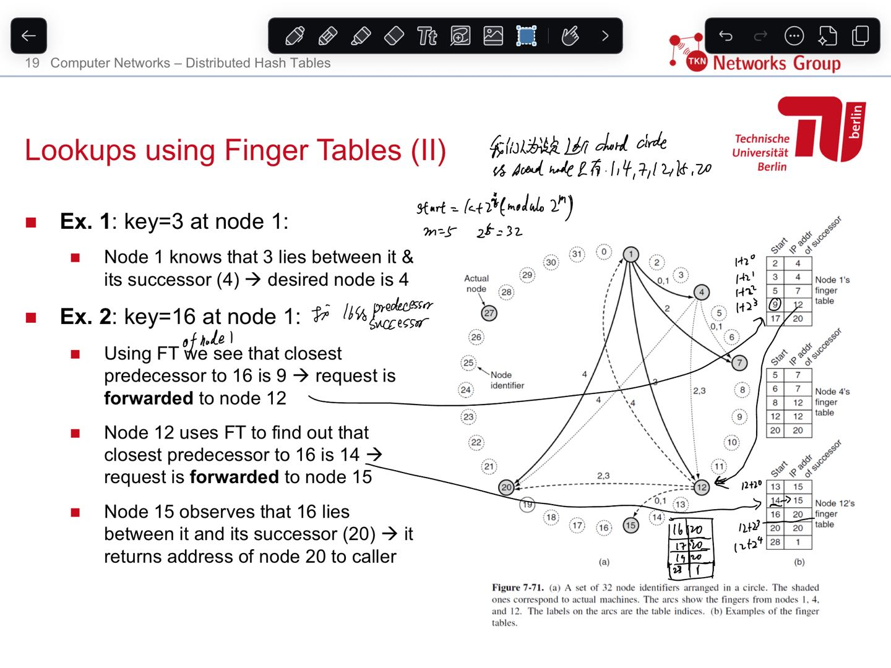

https://aandds.com/blog/p2p-chord.html

https://blog.csdn.net/zhushuai1221/article/details/52345943
# 1 Hash Table 

key 被 hash function  变为 hash 
hash 用来指引 在那个 bucket 中 pair is stored 
然后 这个 key-value pair 就存在这个 bucket 中


Hash collisions  就是 两个 key-value pair 被放在了一个 bucket 中 (最下面 最左边的图 就代表这个情况 )


# 2 Distributed Hash Table (DHT)

一个节点怎样高效地知道在网络中的哪个节点包含它所寻找的数据

首先，每条文件索引被表示成一个(K, V)对.   
K称为关键字，可以是文件名（或文件的其他描述信息）的哈希值，
V是实际存储文件的节点的 IP 地址（或节点的其他描述信息）

所有的文件索引条目（即所有的（K, V）对）组成一张大的文件索引哈希表，只要输入目标文件的 K 值，就可以从这张表中查出所有存储该文件的节点地址。

然后，再将上面的大文件哈希表分割成很多局部小块，按照特定的规则把这些小块的局部哈希表分布到系统中的所有参与节点上，使得每个节点负责维护其中的一块。
这样，节点查询文件时，只要把查询报文路由到相应的节点即可（该节点维护的哈希表分块中含有要查找的(K,V)对）

Distributed Hash Tables (DHT) spread the pairs across a number of computers (buckets, nodes) located arbitrarily across the world.
Note: copies of a single pair can be stored in one or in multiple locations!

The key is hashed to find the proper bucket in a hash table

When a user queries the system, i.e., provides the key, the system uses the hash to find the key-value pair from one of the computers where it’s stored and returns the result. 

## 2.1 DHT Interface

Minimal interface (data-centric)
- lookup(key) → value
- insert(key, value)
- delete(key)

Supports a wide range of applications, because few restrictions
- Value is application dependent
- Keys have no semantic meaning

Note: DHTs do not have to store data useful to end users, e.g., data files … data storage can be built on top of DHTs

## 2.2 DHTs: Problems


Solution of Problem 1 
- 计算 key 的 hash , 然后找到 距离这个 hash 最近的 id 的 node, 将 key-value pair 存到这个最近的 node 
Solution of problem 
- 每个 node 都用一个自己的 Finger Tables, 如果在这自己的  Finger Tables 找不到 某个 key-value pair  中的key的hash 改对应在那个 node 存了这个 key-value pair . 就根据  Finger Tables 跳转到下一个 node 中 , 根据下一个 node 的  Finger Table 再去找. 

# 3 Chord

这里介绍的 Chord 算法就是解决网络内节点定位问题的一种 DHT 实现。它通过多个节点跳转找到我们所查找的资源。

一个节点怎样高效地知道在网络中的哪个节点包含它所寻找的数据

## 3.1 ### Chord 基本要素

节点 ID：NID（node identifier），表示一个物理机器，m 位的一个数字（m 要足够大以保证不同节点的 NID 相同的几率小的可以忽略不计），由节点机器的 IP 地址通过哈希操作得到。  

资源 ID；KID（key identifiers），原为键 ID，其实际表示一个资源（因为 Key 与一个资源 value 哈希绑定），故在本文中统称资源 ID（这样比较直观），m 位的一个数字（m要足够大以保证不同资源的 KID 相同的几率小的可以忽略不计），由 Key 通过哈希操作得到。  

常哈希函数：较之一般哈希函数，节点的加入和离开对整个系统影响最小，另外还有一些优势在此不赘述。在 Chord 中使用 SHA-1 来进行常哈希计算。

首先，每条文件索引被表示成一个(K, V)对.   
K称为关键字，可以是文件名（或文件的其他描述信息）的哈希值，
V是实际存储文件的节点的 IP 地址（或节点的其他描述信息）

## 3.2 Chord环


我们能够觉得这些整数首尾相连形成一个环，称之为Chord环。整数在Chord环上按大小顺时针排列，Node（机器的IP地址和Port）与Key（资源标识）都被哈希到Chord环上，这样我们就假定了整个P2P网络的状态为一个虚拟的环，因此我们说Chord是结构化的P2P网络。

Chord 环： **NID 和 KID 都被分配到一个大小为** **的同一个环上** ，用于资源分配（给某一个节点）和节点分布，以及资源定位（注：在这个环上的 ID 为）。首先我们说资源分配， **资源被分配到 NID>=KID 的节点上，这个节点称为 k 的后继节点，是环上从 k 起顺时针方向的第一个节点，记为 successor(k)。** 而节点分布则顺时针将节点 N 由大到小放在这个环上。如图 [5](https://aandds.com/blog/p2p-chord.html#org0000011) 所示，这是一个 m=6 的环，其中有 10 个节点，5个资源，K10 的后继节点为 N14，也就是说 K10 被分配给了 N14。例如： **K9 到 K14 如果存在，都会被分配给其顺时针方向的下一个节点，即 N14；又如，K15 到 K21 如果存在，都会被分配给其顺时针方向的下一个节点，即 N21。**  


Figure 5: 节点 ID 和资源 ID 在同一个环上，且资源 ID 代表的数据存放在顺时针方向“下一个”节点 ID 上（如 K10 被分配给了 N14）

---


下面有几个定义：
- 红色点为Node (actual node)，蓝色为标志符 (node identifier )
- 我们称Chord环上的每个节点为标志符, 如果我们想 产生一个 $2^{160}$ 的空间, 则就有 $2^{160}$ 个标志符
- 假设某个Node映射到了某个标志符，则继续称该标准符为Node
- 我们称Chord环上的节点, 代表一个 机器 , 当 某个key 的node 落在了某区间, 则 这个 key-value-pair  就存在 这个区见的 successor node 
- 按顺时针，节点前面的成为前继(predecessor),节点后面的成为后继（successor)；同理，第一个predecessor称之为直接前继，第一个successor称之为直接后继
- 非常显然，分布在Chord环上的Node数远远小于标志符数（2160是一个无法衡量的天文数字），这样Chord环上的Node就会非常稀疏地分布在Chord环上，理论上应该是随机分布，但如前面一致性哈希的讨论，假设节点数量不多，分布肯定是不均匀的，能够考虑添加虚拟节点来添加其平衡性，假设在节点较多（比方大型的P2P网络有上百万的机器）就不必引入虚拟节点。


## 3.3 chord: lookup  简单的资源定位方法

考虑如下场景：节点 n 寻找 KID 为 id 的资源，此时节点 n 首先问询是否在下一个节点上（find_successor），这要看资源 k 的 KID 是否在该节点 NID 和下一个节点的 NID 之间，若在则说明资源 k 被分配给了下一个节点，若不在则在下一个节点上发起同样的查询，问询下下一个点是否有该资源。如此迭代下去，用伪代码定义这个操作：

```
n.find_successor(id)
  if (id є (n; successor])
    return successor;
  else
    // 将查询沿着环进行下去
    return successor.find_successor(id);
```

不论什么查找仅仅要沿Chord环一圈结果肯定能够找到，这种时间复杂度是O(N)，N为网络节点数，但对一个上百万节点，且节点常常增加、退出的P2P网络来说，O(N)是不可忍受的，因此Chord提出了以下非线性查找的算法 (就是使用 finger table )


  

Figure 6: 简单的资源定位方法（效率不高）

节点 N8 寻找 K54 这个资源，N8.find_successor(K54)发现下一个节点 N14 不合符 ，于是 N14 发起同样的搜索，然后一跳一跳后直到节点 N56 满足

，于是得知资源 K54 在 N56 这个节点上。  

在一个有 N 个节点的环上，这样的查找方法显然在最坏的时候要查找 N 次才能得到所需资源的位置，查找次数与节点个数成线性关系。显然，这样的效率不给力，所以 Chord 使用了可伸缩资源定位的方式来提高效率。

## 3.4 Chord: Joining Operation 

Chord 通过在每个节点的后台周期性的进行 stabilization 询问后继节点的前序节点是不是自己来更新后继节点以及路由表中的项。  

有下面几个操作：  
join()：节点 n 想加入时，调用 join(n')。其中 n'可以是任意节点，n'负责找到新节点 n 的直接后继节点。  
stabilize(): 每个节点周期性地运行这个操作，以询问后继节点的前序节点是不是自己。  
notify(): 如果 stabilize()过程中发现节点关系变化，则通过相邻节点做调整。  
fix_fingers(): 修改路由表。


如果要新加入一个 node 

- Each node A periodically sends a stabilize() message to its successor B
- Upon receiving a stabilize() message, node B
    - returns its predecessor B’= pred(B) to A by sending a notify(B’) message
- Upon receiving notify(B’) from B,
    - if B’ is between A and B, A updates its successor to B’
    - A doesn’t do anything, otherwise

A -> stabilize -> B 
B ->nofity (B') ->A
A-> B'


### 3.4.1 例子1


### 3.4.2 例子2

1 
具体的，例如：图 [11](https://aandds.com/blog/p2p-chord.html#org000002a) 是原先的结构。  

  

Figure 11: 加入节点前的结构


2
现在 N26 节点要加入系统，首先它指向其后继 N32，然后通知 N32，N32 接到通知后将 N26 标记为它的前序节点（predecessor）。如图 [12](https://aandds.com/blog/p2p-chord.html#org000002c) 所示。  

  

Figure 12: N26 节点想要加入系统

然后 N26 修改路由表，如图 [13](https://aandds.com/blog/p2p-chord.html#org000002e) 所示。  

  

Figure 13: N26 修改路由表

下一次 N21 运行 stabilize()询问其后继节点 N32 的前序节点是不是还是自己，此时发现 N32 的前序节点已经是 N26，如图 [14](https://aandds.com/blog/p2p-chord.html#org0000030) 所示。  

  

Figure 14: N21 通知 N26 修改前继节点

于是 N21 就将后继节点修改为 N26，并通知 N26 自己已经将其设置为后继节点，N26 接到通知后将 N21 设置为自己的前序节点。  


3 
这个加入操作会带来两方面的影响：  

1）、正确性方面：当一个节点加入系统，而一个查找发生在 stabilization 结束前，那么此时系统会有三个状态：  
A、所有后继指针和路由表项都正确时：对正确性没有影响。  
B、后继指针正确但表项不正确：查找结果正确，但速度稍慢（在目标节点和目标节点的后继处加入非常多个节点时）。  
C、后继指针和路由表项都不正确：此时查找失败，Chord 上层的软件会发现数据查找失败，在一段时间后会进行重试。  

总结一下：节点加入对数据查找没有影响。  

2）、效率方面：当 stabilization 完成时，对查找效率的影响不会超过 O(log N) 的时间。当 stabilization 未完成时，在目标节点和目标节点的后继处加入非常多个节点时才会有性能影响。可以证明，只要路由表调整速度快于网络节点数量加倍的速度，性能就不受影响

## 3.5 Chord: lookup 可伸缩方法（with Finger table ） 

在每个节点 N 上都维护了最多有 m 项（m 为 ID 的位数）的路由表（称为 finger table），用来定位资源。这个表的第i 项是该节点的后继节位置，至少包含到 2^(i-1) 后的位置。还是延续上边的例子。

从直觉上来说，使用finger table 查找过程应该是指数收敛的，相似二分法的查找，收敛速度应该是非常快的；反过来，查找时间或路由复杂度应该是对数即的，


### 3.5.1 finger table 建立过程 

1. 每一个节点都维护一个Finger表，该表长度为m（m就是位数，在Chord中为160），该表的第i项存放节点n的第(n+2i-1) mod 2m个successor(1<=i<=m)
2. 每一个节点都维护一个predecessor和successor列表，该列表的作用是能高速定位前继和后继，并能周期性检測前继和后继的健康状态
3. 就是说存放的successor是按2的倍数等比递增，自所以取模是由于最后的节点的successor是開始的几个节点，比方最大的一个节点的下一个节点定义为第一个节点
4. 资源Key存储在以下的Node上：沿Chord环，hash(Node)>=hash(key)的第一个Node，我们称这个Node为这个Key的successor
5. 给定一个Key，按以下的步骤查找其相应的资源位于哪个节点，也就是查找该Key的successor：（假如查找是在节点n上进行）

- 查看Key的哈希是否落在节点n和其直接successor之间，若是结束查找，n的successor即为所找
- 在n的Finger表中，找出与hash(Key)距离近期且<hash(Key)的n的successor，该节点也是Finger表中最接近Key的predecessor，把查找请求转发到该节点
- 继续上述过程，直至找到Key相应的节点


### 3.5.2 例子 1


  

Figure 7: Chord 路由表实例（称为 finger table）


---

节点 N8 的路由表中（如图 [7](https://aandds.com/blog/p2p-chord.html#org000001c) 所示），左边那一栏包含了 N8+1 到 N8+32 的位置，右边那一栏每个位置对应的实际存在的节点。比如 N8+1-->N14，表示在 N8 后的第一个位置上的资源由 N14 来负责。这样记录有以下优势：  
- 每个节点只包含全网中一小部分节点的信息。  
- 每个节点对于临近节点负责的位置知道的更多，比如 N8 节点对于 N14 负责的位置知道 3 处，而对 N21 负责的位置只知道 1 处。 
- 路由表通常不包含直接找到后继节点的信息，往往需要询问其他节点来完成。
当在某个节点上查找资源时，首先判断其后继节点是不是就持有该资源， **若没有则直接从该节点的路由表从最远处开始查找，** 看哪一项离持有资源的节点最近（发现后跳转），若没有则说明本节点自身就有要寻找的资源。如此迭代下去。  


---

例如：节点 N8 寻找 K54 这个资源，如图 [8](https://aandds.com/blog/p2p-chord.html#org000001e) 所示。  

  

Figure 8: 节点 N8 寻找 K54 这个资源

1 
首先，在 N8 上查找后继节点为 N14，发现 K54 并不符合

的要求，那么直接在 N8 的路由表上查找符合这个要求的表项（由远及近查找），此时 N8 的路由表为图 [9](https://aandds.com/blog/p2p-chord.html#org0000020) 所示。  

  

Figure 9: N8 节点的路由表

我们发现路由表中最远的一项 N8+32=N42 满足

，则说明 N42 这个点离持有 K54 这个资源的节点最近（因为 N42 在该路由表中离 N8 这个节点最远），那么此时跳到 N42 这个节点上继续查找。N42 的后继节点为 N48，不符合

的要求，说明 N48 不持有资源 54，此时，开始在 N42 的路由表上查找。  

2 
N42 节点的路由表为图 [10](https://aandds.com/blog/p2p-chord.html#org0000022) 所示。  

  

Figure 10: N42 节点的路由表

我们由远及近开始查找，发现 N42+8=N51 满足

，则说明 N51 这个点离持有 K54 这个资源的节点最近，那么此时跳到 N51 这个节点上继续查找。N51 节点的后继节点为 N56，符合 ，此时定位完成，N56 持有资源节点 K54。

### 3.5.3 例子2 

> finger table 只要 从 2^0 计算到 2^(m-1) 就好了 




## 3.6 Chord 节点失败的处理

我们可以看出，Chord 依赖后继指针的正确性以保证整个网络的正确性。但如图，若 N14, N21, N32 同时失效，那么 N8 是不会知道 N38 是它新的后继节点。为了防止这样的情况，每个节点都包含一个大小为 r 的后继节点列表，一个后继节点失效了就依次尝试列表中的其他后继节点。可以证明，在失效几率为 1/2 的网络中，寻找后继的时间为 O(log N) 。


## 3.7 Chord Performance (Improvements)


# 4 Consistent Hashing 和 DHT 的区别

[Chord](https://en.wikipedia.org/wiki/Chord_(peer-to-peer)) 是一种能在 P2P 网络中快速定位资源的的算法，可以认为它是分布式哈希表（Distributed hash table, DHT）的一种实现，它同时也是一种一致性哈希（Consistent Hashing）算法。Chord 算法本身并不关心资源是如何存储的，只是从算法层面研究资源的取得，我们可以认为 Chord 的 API 简单到只有 set 和 get。

分布式哈希（[DHT](https://en.wikipedia.org/wiki/Distributed_hash_table)）和一致性哈希（[Consistent Hashing](https://en.wikipedia.org/wiki/Consistent_hashing)）有什么区别呢？  

分布式哈希: 将哈希表分散在不同的节点上，并且提供相应的方法来查找。  
一致性哈希: 当节点宕机或者扩容的时候，需要重新哈希，一致性哈希实现的 DHT 避免对大量的数据重新哈希（如 Chord 算法就是一种一致性哈希算法），所以 **一致性哈希是 DHT 的一种实现。**


