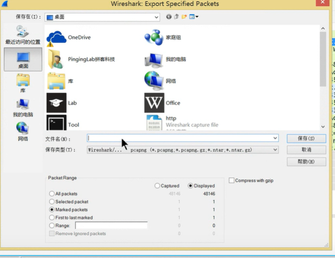

# 1 标记数据包

1 
右键点击, 标记这个包 , 被某种颜色标记 
颜色的选择: 通过首选项可以修改

2 不同的协议使用不同的颜色
数据包列表区中不同的协议使用了不同的颜色区分。协议颜色标识定位在菜单栏View --> Coloring Rules。如下所示

# 2 合并数据包
Hauptmenu -> file ->merge

可以选择两个数据包 合并其, 然后通过 wirshark 打开 

# 3 打印数据包

Hauptmenu -> file ->print 

## 3.1 导出数据包 
Hauptmenu -> file -> export specified Packets

1. 只导出标记的数据包
2. 只爆出选择的数据包
3. 导出为csv格式 

