# 1 数据流追踪 (Follow Stream)

Analyse -> follow the stream 

# 2 专家信息 (Expert Info )
Analyse -> Expert Info 

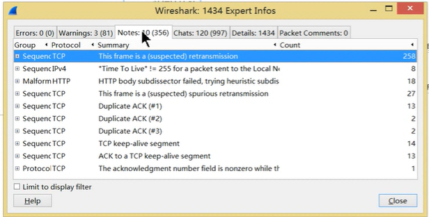

# 3 统计摘要说明

statustucs -> summary 

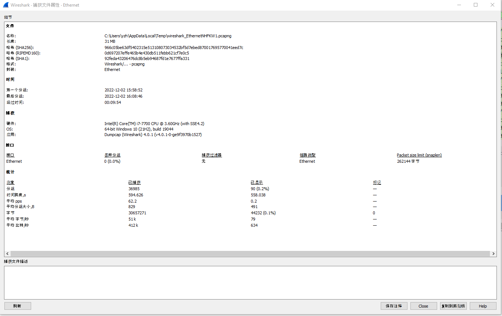

看现在界面中 所有包 综合在一起后的统计信息
比如 
- 一共有多少个包
- 每个包的平均大小

# 4 协议分级 (Hierarchy)

statistics -> Hierarchy 
统计不同协议的占用百分比, 可以了解 整个网络那些流量占用的多
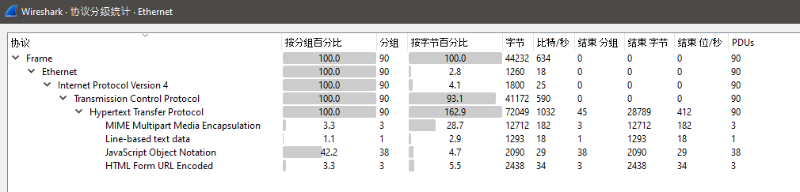

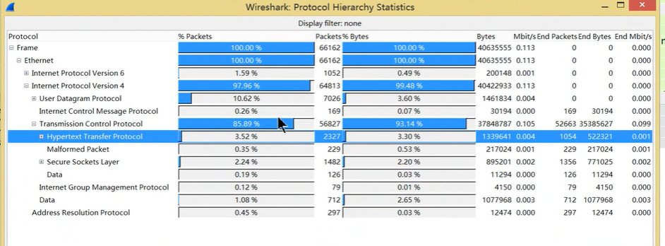

End Packets: 
- 就是指 单纯的 tcp 包. 这些包中不再有下属的包了,(比如说不在还有 http 包在 tcp 之下了)
- 某些tcp 下面还有 http 包, 这种tcp包 不在 End packets 的统计数目内

# 5 网络节点和网络会话
Statistics -> Conversion/ Endpoint

网络会话 Conversion: 源节点和目的地节点 为关系的 数据都统计出来
网络节点 Endpoint : 以单个ip 的为标准, 统计这些单个ip地址下的通信统计信息  

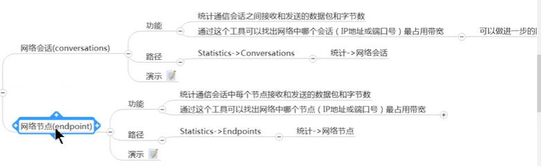

## 5.1 网络会话(Conversion)

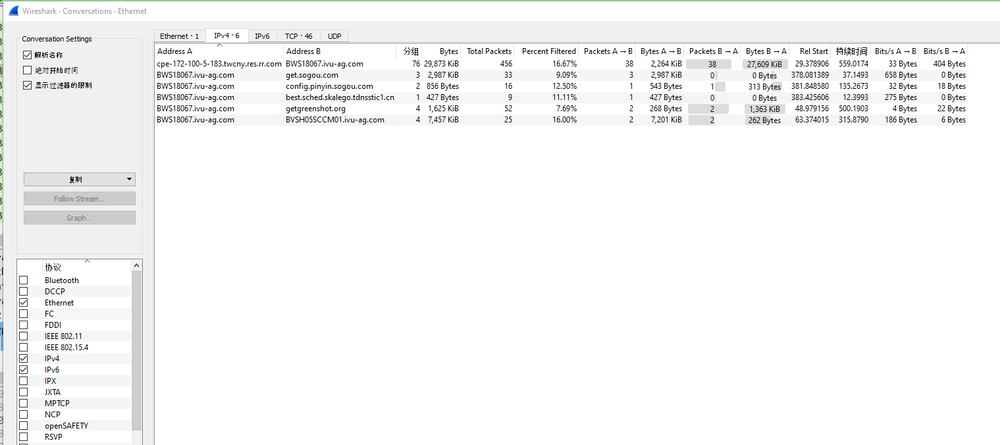

具有 Follow Stream 和 graph 功能

## 5.2 网络节点 (Endpoint)

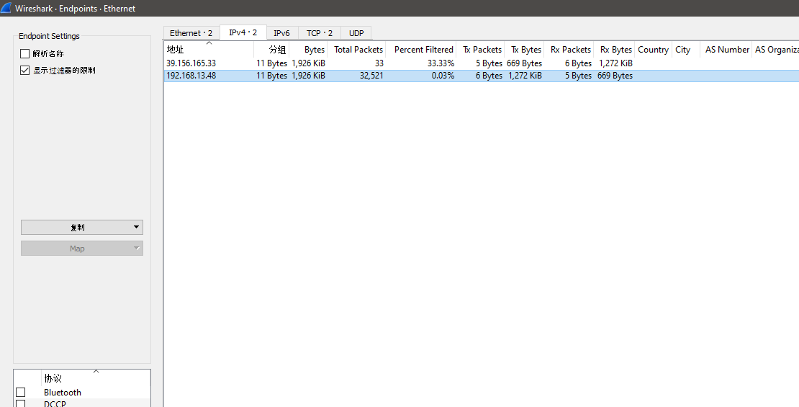

# 6 数据包长度统计 (Packet Lengths)
Statistics -> Packet Lengths

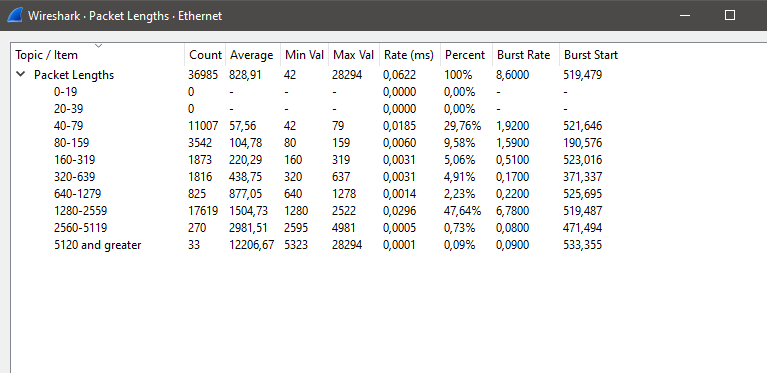

# 7 图表分析 

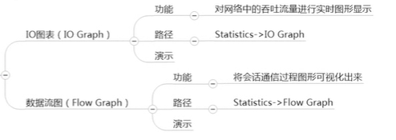

## 7.1 IO Graph (吞吐量)
统计网卡的吞吐量 实时显示
可以自己顶一个 graph , 给这个 graph 定义对应的 display Filter 

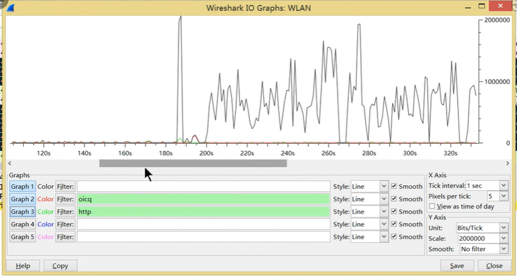

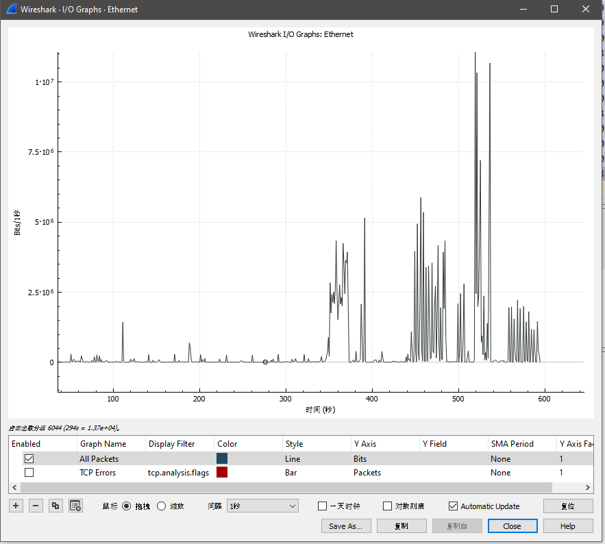

## 7.2 Flow Graph
将会话通信 (source 和 destination 之间的关系) 过程 图形化显示出来 

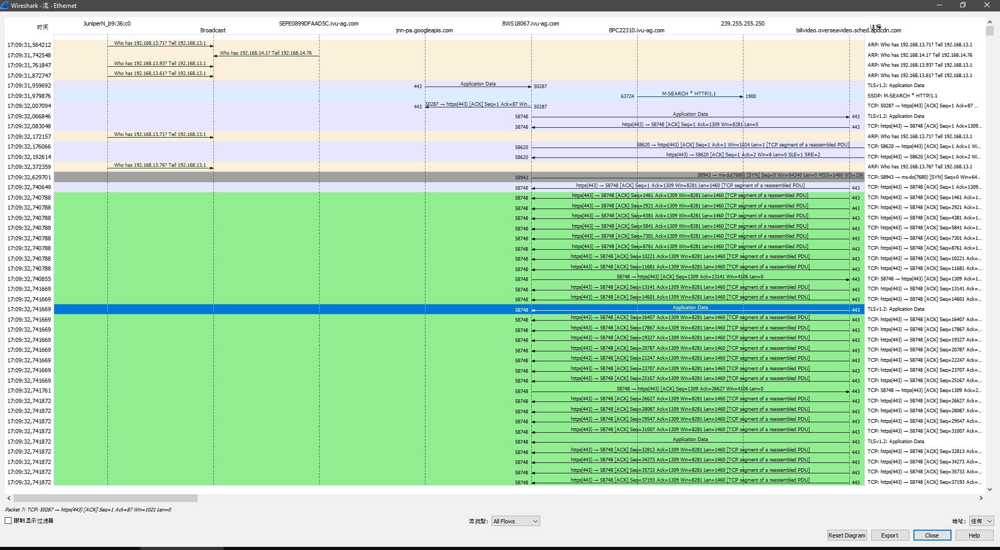
